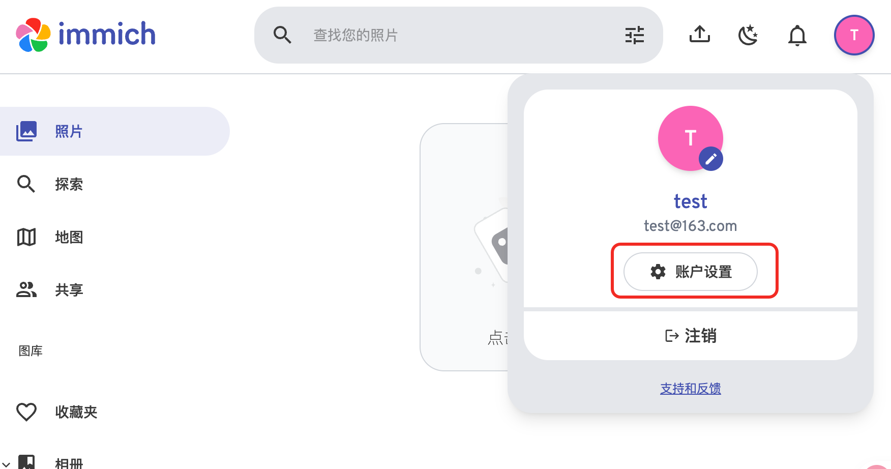
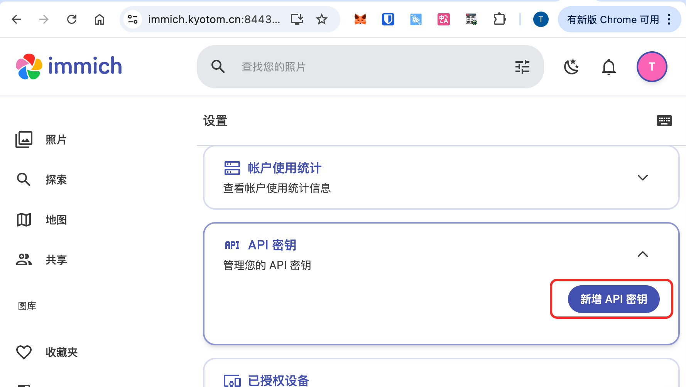
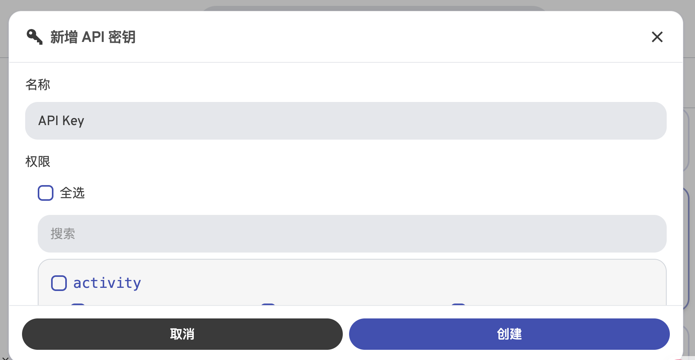

# plugin-immich-picture-bed

immich-picture-bed - Halo 插件

## 简介

集成 Immich 图片存储服务作为 Halo 的存储后端，目前仅支持存储图片。

## 使用说明

### API Key

在使用插件前，需要在 Immich 中创建一个 API Key。可以在 Immich 的账户设置 -> API 密钥中找到 API Key 的管理界面。可以参考 [Immich 官方文档](https://immich.app/docs/features/command-line-interface/#obtain-the-api-key) 来创建 API Key。

Steps1:



Steps2:



Steps3:



### Immich 相册名称

该选项可选，旨在为 Immich 中的图片存储提供一个相册名称，方便用户管理。如果不设置，则不加入相册。

## 开发环境

- Java 21+
- Node.js 18+
- pnpm

## 开发

```bash
# 构建插件
./gradlew build

# 开发前端
cd ui
pnpm install
pnpm dev
```

## 构建

```bash
./gradlew build
```

构建完成后，可以在 `build/libs` 目录找到插件 jar 文件。

## 许可证

[GPL-3.0](./LICENSE) © kyo-tom 